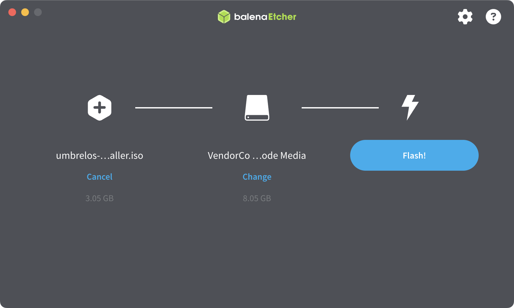
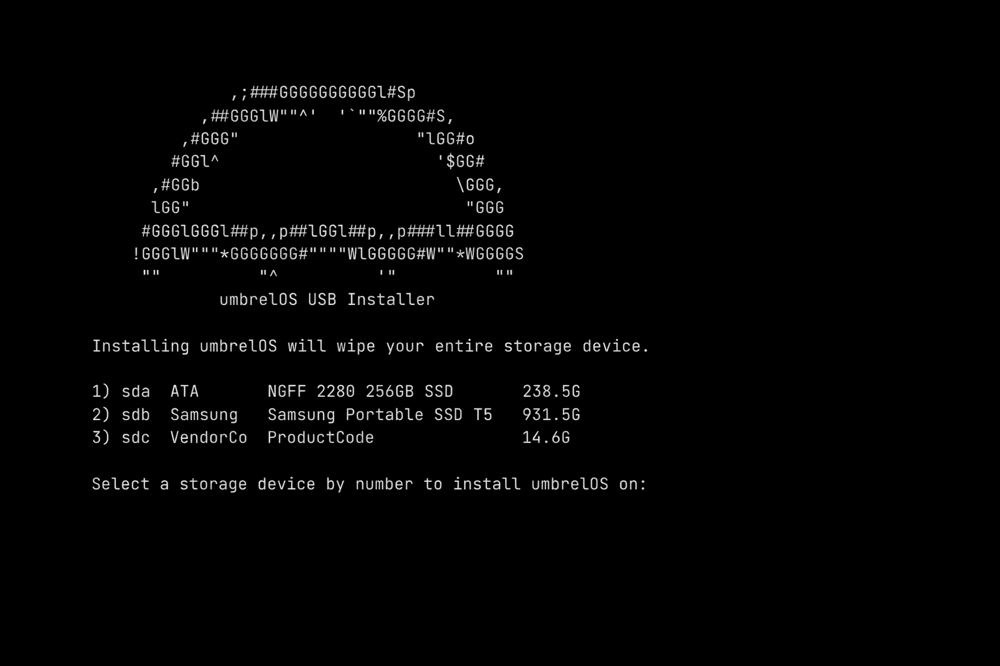
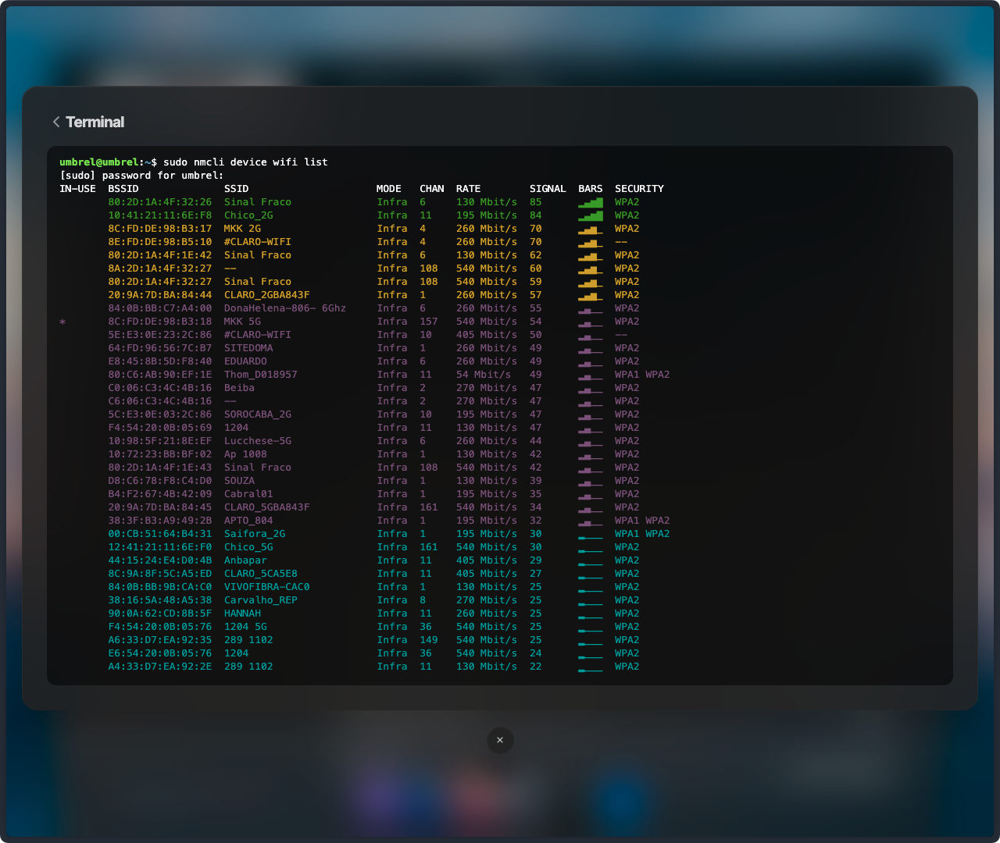
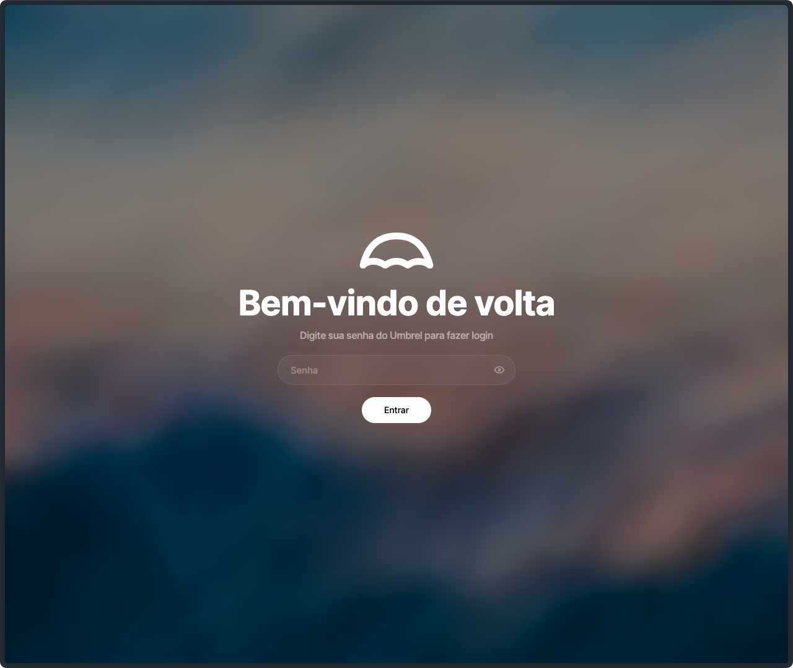
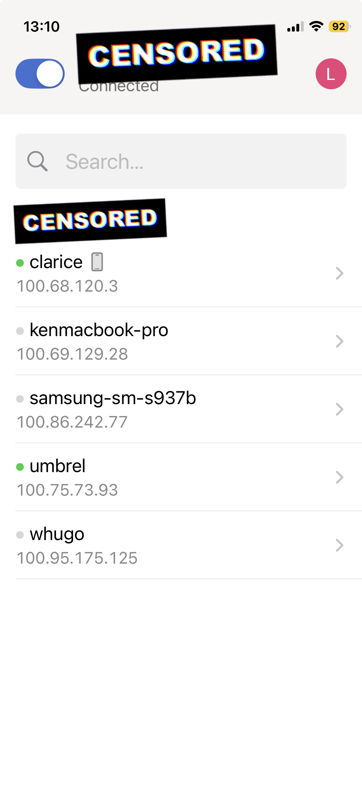

## TLDR

_1. Prepare a bootable USB with the [**umbrelOS `.iso`**](https://download.umbrel.com/release/latest/umbrelos-amd64-usb-installer.iso) and [**Balena Etcher**](https://www.balena.io/etcher/)_

_2. Boot your server device from USB_

_3. Install [**umbrelOS**](https://umbrel.com/umbrelos) and remove the USB_

_5. Plug in your ethernet cable and boot up **OR** boot up and configure WiFi_

_6. Access the server interface via your browser at http://umbrel.local or http://umbrel_

_7. Use [**Tailscale**](https://tailscale.com/) to access your server from anywhere._

---

## Introduction

A few days ago, I was looking for a place to store my files online so I could access them from anywhere.

While comparing cloud storage services, I thought:

_I'm on a low budget, but I have some free time._ 🤔

That's when I decided to create my own Linux server to store my files.

## What's self-hosting?

It's like running self-hosted services (a.k.a. applications) on your own infra to **replace cloud providers** options.

Its purpose is to **serve** something to you.

It can be hosted on a normal computer which can vary in size and hardware.

By digging a little bit, I discovered many interesting solutions. It can feel intimidating at first, but fear not. I'll show you how **easy** it is to set it up.

## Requirements

What will you need? An old **PC**, a **USB** drive with at least 4 GB and a Linux OS called [**umbrelOS**](https://umbrel.com/umbrelos) ☂️.

## How to

I'm assuming you are familiar with some computer basics, so I'll summarize the steps here to keep the post easy to read.

### 1. Create bootable umbrelOS USB

- Download the [**latest umbrelOS `.iso`**](https://download.umbrel.com/release/latest/umbrelos-amd64-usb-installer.iso) (for x86 systems)
- Download [**Balena Etcher**](https://www.balena.io/etcher/)
- Plug your USB stick and make sure it doesn't contain any important data, as it will be **formatted**
- Use Balena Etcher to flash the downloaded `.iso` file into the USB
- Remove the USB

### 2. Boot from USB

- Plug the USB stick into the desirable server device
- Turn on the server device and it should automatically boot from the USB (if not, you might need to change the **boot priority** in BIOS settings)

### 3. Install umbrelOS

After the system boots up, it will present you the following:

- Identify the correct internal storage to install umbrelOS and note it's corresponding number. For example, in the example above, if we want to install it on **ATA** drive we would type **"1"** (without quotes)
- Press <kbd>Enter</kbd>

### 4. You fulfilled your mission, dear USB

After a while the process will be completed

- Press any key to shutdown
- Remove the USB stick

> ⚠️ **Important!**
>
> At this point, check if the Ethernet cable is connected. If you're on WiFi check the section bellow. 👇🏻

- Ensure the USB stick is no longer **connected**
- Turn on the server device (you might need to change the **boot priority** in BIOS settings)

### 5. Configure WiFi (or skip it)

- Ensure the USB stick is no longer **connected**
- Turn on the server device (might change the **boot priority** in BIOS settings)
- You'll see that the server is for terminal access only. Login with user and password both **"umbrel"**
- Run `sudo nmcli device wifi list` and check for your WiFi
- Run `sudo nmcli device wifi connect "YOUR_WIFI_NAME" password "YOUR_PASSWORD"` to connect to your WiFi

### 6. Acessing it locally

> ⚠️ **Important!**
>
> Make sure the server device and the device you're trying to access from are on the **same LAN**.

- From your browser, try access http://umbrel.local or http://umbrel

### 7. Acessing it from anywhere

- Access http://umbrel.local or http://umbrel
- Login in
- From the store, install [**Tailscale**](https://tailscale.com/)
- Sign in into Tailscale
- From your phone, install Tailscale
- Sign in into Tailscale using the **same login** from above
- From your phone, access http://umbrel.local or http://umbrel

## My server, my rules

In my case, I did it mainly because I was low on **money**, and building it myself would put me **in control** of the server.

If you don't want to rely on big techs and **privacy** matter for you, this is for you!

Additionally, deploying a service like this would give me both personal and professional **experience**.

Reproducing the steps above you have a fully workable server to start building your own self-host services. The possibilities are endless! ✨

**Thank you for reading!**

Want to help me? If these steps ever helped you out or wanna keep me excited on
sharing learning techniques like this? Consider <a href="https://buymeacoffee.com/vulgofoobar">**buying me a coffee**</a>
or supporting me on <a href="https://ko-fi.com/vulgofoobar">**Ko-fi**</a>.
