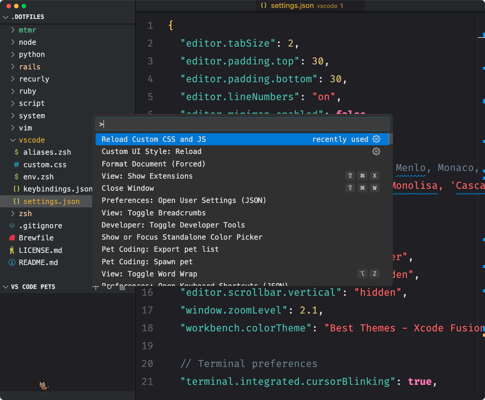

Today I'll show you a straightforward method for theme elements on your
[**VS Code**](https://code.visualstudio.com/) using CSS. To
unlock this we will install an extensions that **inject CSS** into the editor.

_How cool is using a piece of software that feels like home?_

Customizations like theming and shortcut preferences may sound useless at first,
but they're the kind of things that spark joy and empowers **productivity**.

An editor is a software that we use regularly in our daily basis. So for me,
every effort in increasing **appeal** and making **navigation easy** is
something that is worth doing.


## Embrace the command palette

Some of us might find mouse movement tedious and slow. _**Developers huh?**_ 
Fortunately, there are shortcuts for faster and simple way to access things.

One of my favorite is the command palette and you can open it with
`cmd + shift + P`. From the modal that opens, start typing for search the
command you want to execute. A shortcut for other shortcuts, if you will. For
example, open the command palette, type "devtools" and select
**Developer: Toggle Developer Tools**. 

DevTools in the editor? _**Is this real life?**_

Now we can inspect the command palette modal CSS identifier. With the
DevTools open on the elements tab, open the command palette and check for the
CSS identifier (it's `.quick-input-widget`, by the way).


## I had preferences once

By default, the process of theming is either editing the `setting.json` file
and `keybindings.json` (for shortcut preferences) or installing theme focused
extensions.

That's fine for many cases, but there are parts of the VS Code interface that
aren't accessible through these methods.

To do this, we use extensions that allow us to modify VS Code's **CSS elements**
and unlock more customization options!


## Adding custom CSS

Now search and install for the [**Custom CSS and JS Loader**](https://marketplace.visualstudio.com/items?itemName=be5invis.vscode-custom-css)
extension.

Create a `custom.css` file anywhere you want, and reference that in your
`settings.json` like this:

```json
"vscode_custom_css.imports": ["file:///absolute/path/to/custom.css"],
```

The `custom.css` file is the place to add your styles. For example, add the
following:

```css
.quick-input-widget {
  top: 50% !important;
  left: 50% !important;
  transform: translate(-50%, -50%) !important;
  box-shadow: none !important;
}
```

Because we've changed some styles, we need to reload the extension. Open the
command palette and select **Reload Custom CSS and JS** and then restart VS Code.

Now our command palette modal always appears **centered**! 🎉



The idea for this post came with a sudden desire to make my VS Code more minimal
for my eyes. I ended up changing a whole bunch of things that I wouldn't bother
you with all the details.

But feel free to check out [**my VS Code settings**](https://github.com/vulgofoobar/dotfiles/tree/master/vscode)
for inspiration.


## GitHub recent absorption by Micro$oft

[**The announcement**](https://www.tomshardware.com/software/programming/github-folds-into-microsoft-following-ceo-resignation-once-independent-programming-site-now-part-of-coreai-team)
raised some **red flags** in my head. One concern is that my code in VS Code
might be used to train AI or that Copilot could be [violating popular open-source
licenses](https://githubcopilotlitigation.com/) without my consent. And secondly,
it reminds me not to rely too much on popular software **we don’t own and use every day**.
But those are topics for another post.

_How cool is using a piece of software that feels like home?_ 

Wait, I've already said that. 😛

**Thank you for reading!**


Want to help me? Beyond my formal work and freelancing, I've never made a penny
from my content. But hey, anything I've shared ever helped you out or wanna keep
me excited on sharing cool stuffs? Consider <a href="https://buymeacoffee.com/vulgofoobar">**buying me a coffee**</a>
or supporting me on <a href="https://ko-fi.com/vulgofoobar">**Ko-fi**</a>.