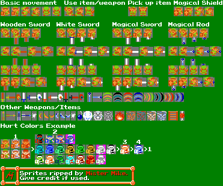
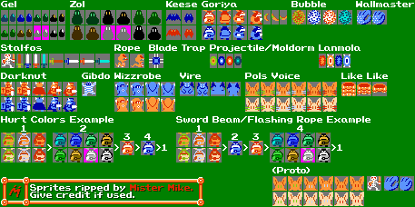

Dia desses logo após encher o buchinho com o almoço no meu momento feliz do dia,
coloquei um vídeo aleatório do canal do Youtube do [MortMort](https://www.youtube.com/user/atMNRArt)
pra ver enquanto fazia minha digestão. O canal tem sido um dos meus preferidos
nesse meu início de procura por conteúdos de pixel art. Ele é um dos que mais tem me chamado
atenção pela vasta quantidade de vídeos explicativos e técnicos sobre pixel art.
Super recomendo!

O [vídeo](https://www.youtube.com/watch?v=cWKhytYUGTg&t=70s) que pregou minha atenção
ele compartilha dicas, truques e tutoriais da interweb. E uma das dicas foi a que
originou esse post.

## The Spriters Resource

O [The Spriters Resource](https://www.spriters-resource.com) foi justamente uma
dessas dicas que ele soltou no vídeo.
O site nada mais é do que uma grande coleção muito massa de materiais de vídeo game.
Dentre recursos disponíveis vc encontra sprites, modelos, texturas e sons.

Fiquei super animado para acessar o site pra dar uma olhadinha. O primeiro sprite
que bati o olho foi a do The Legend of Zelda do Nintendo. Saca só que da ora:

Na minha humilde opinião o achado é uma mina de ouro seja para fins de estudo,
para estimular a criatividade no design de personagens, ou apenas para
trazer de volta uma pouco da nostalgia dos jogos que fizeram parte da sua vida.

O site foi um grande motivador pra montar esse blog. Então, quem venha a ler
esse post, tomara que minha mesma alegria seja passada para vc que também
não sabia da existência dessa belezinha.

Sei que ta foda, mas beba água e confie mais em vc!

Valheuuuu!
